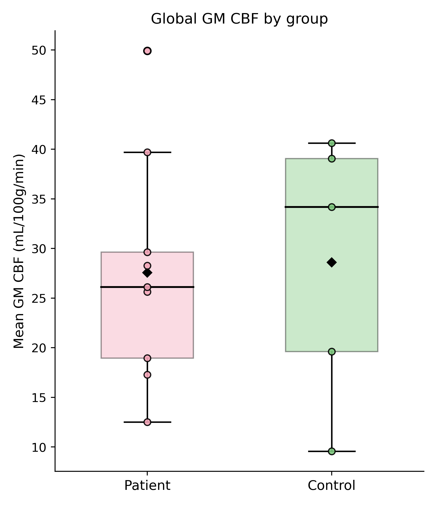
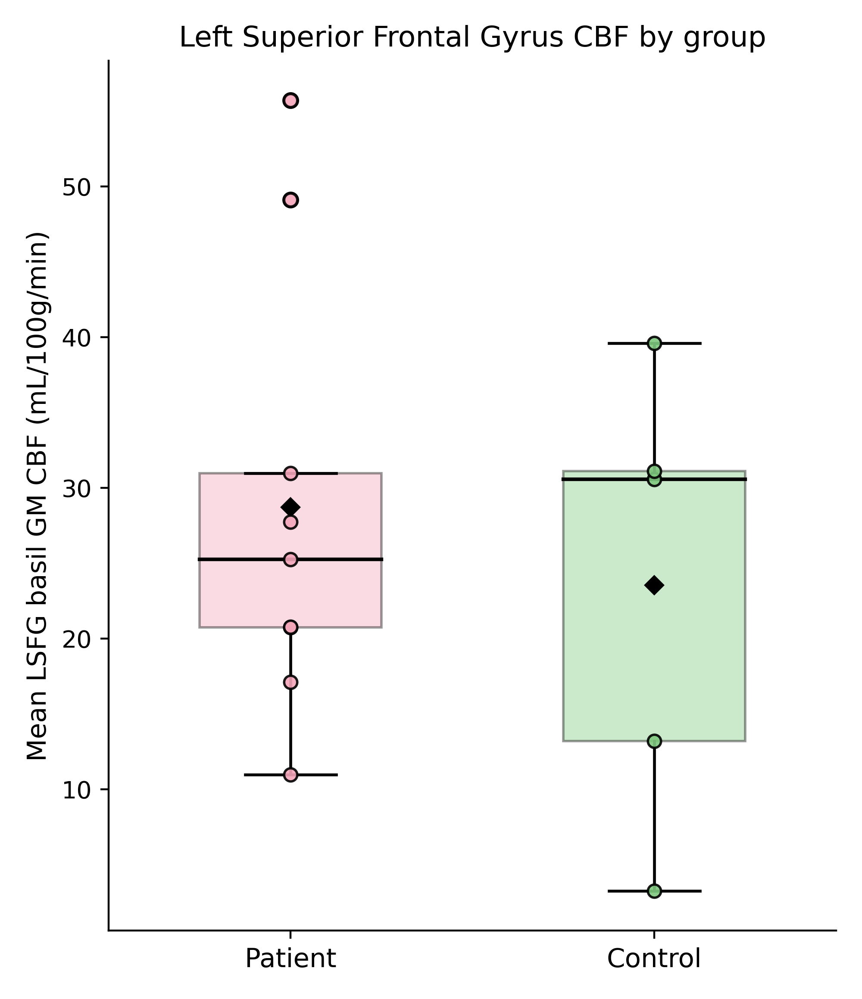
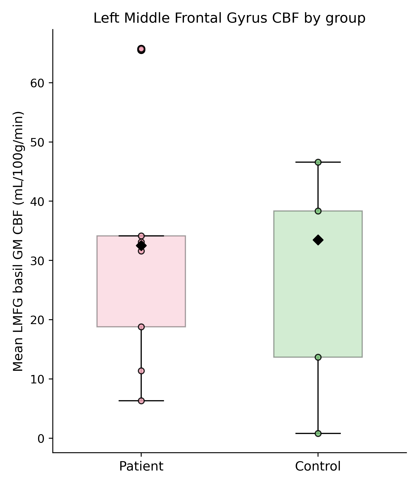
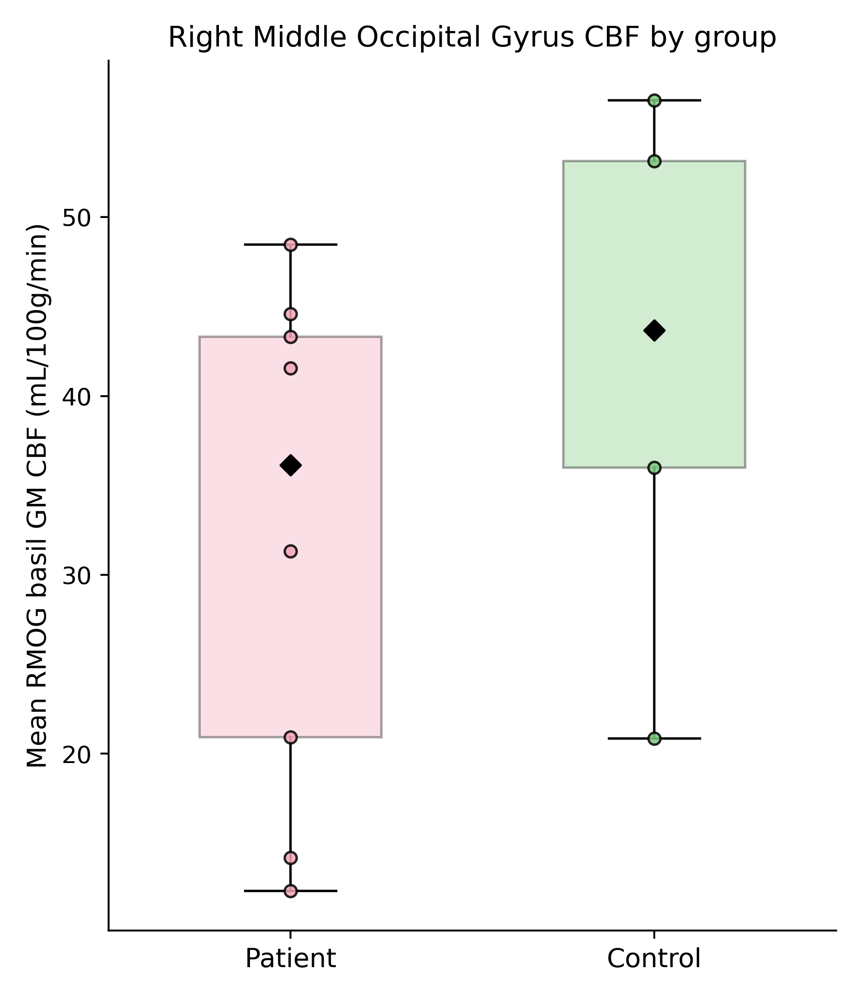
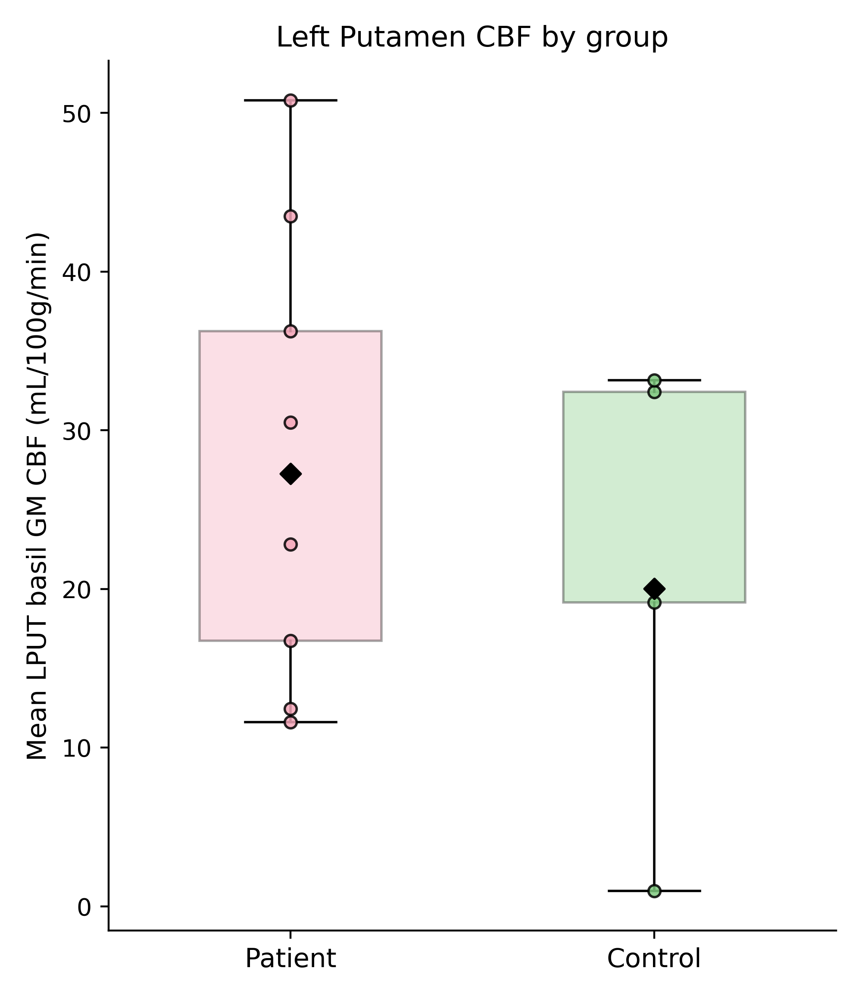
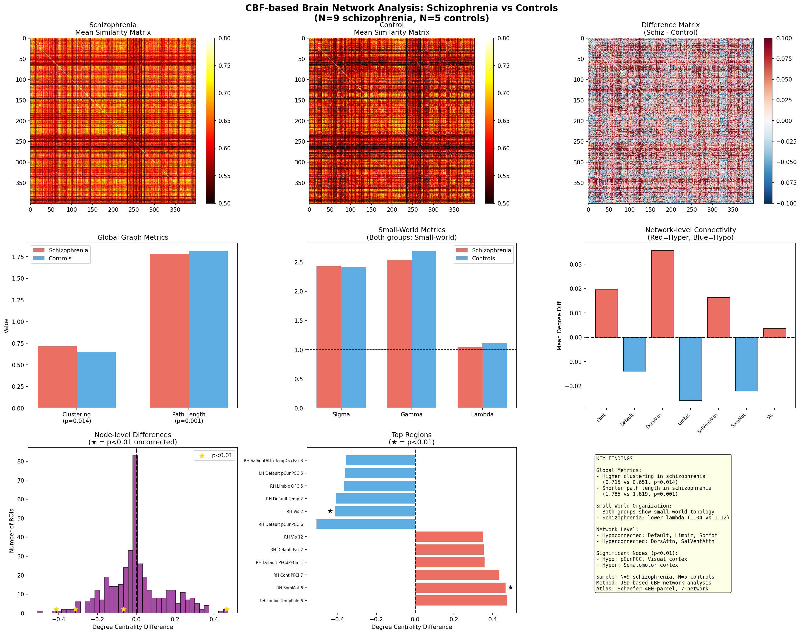
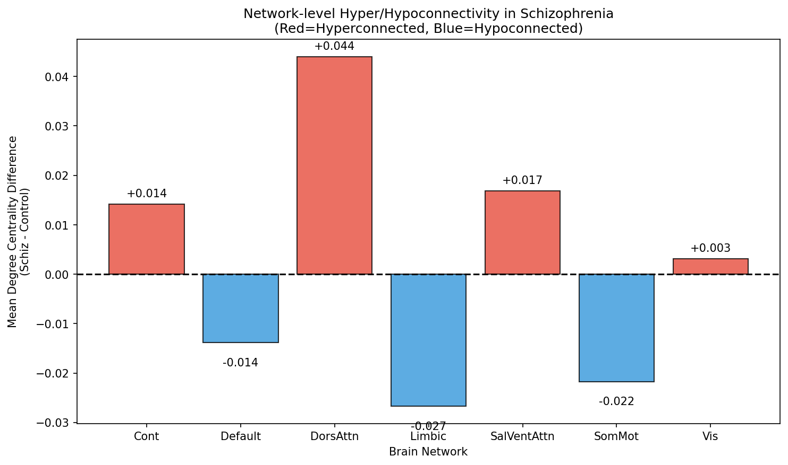
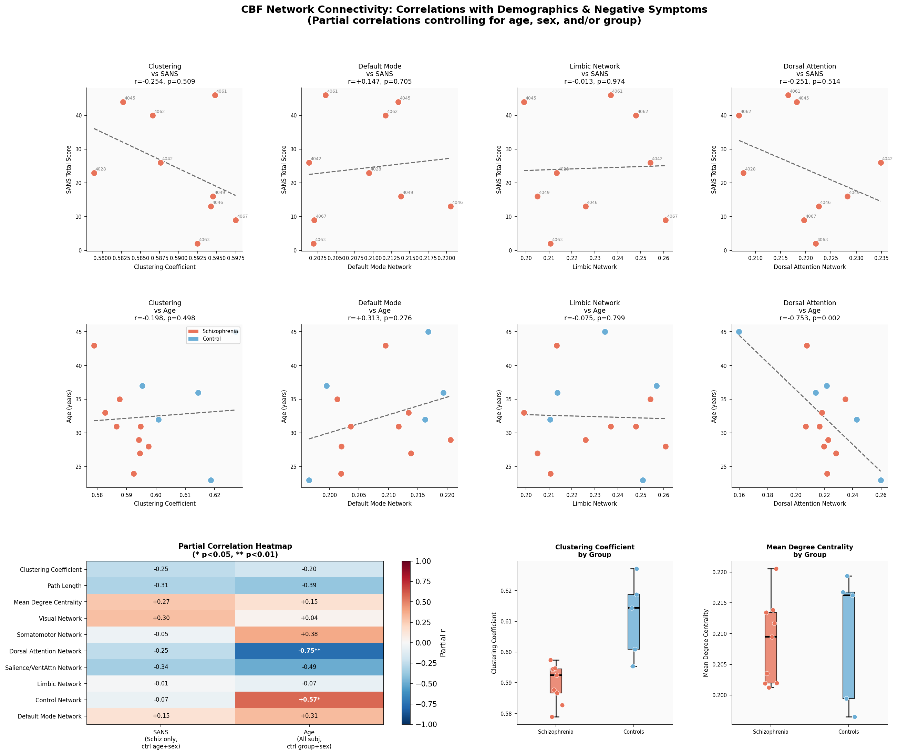

# Figures

## Global GM CBF by Group

Mean global gray matter CBF compared between patients and controls.

## Left Superior Frontal Gyrus (LSFG)

Basil GM CBF in the left superior frontal gyrus for patients and controls. Patients show a lower
median and mean CBF than controls, consistent with the meta-analytic finding of frontal
hypoperfusion (left SFG) in schizophrenia-spectrum disorder (SSD). This supports the hypothesis
that hypoperfusion in dorsal frontal regions involved in fronto-parietal and attention networks
may contribute to cognitive and negative symptoms.

## Left Middle Frontal Gyrus (LMFG)

Mean basil GM CBF in the left middle frontal gyrus by group. Patients show a downward shift in
LMFG CBF relative to controls, in line with meta-analytic evidence for reduced rCBF in left MFG
in SSD. Because LMFG is part of the same frontal control networks as LSFG, lower perfusion here
fits a proposed "hypofrontality" mechanism linking frontal hypoperfusion to impaired
executive/working-memory function and more severe negative symptoms.

## Right Middle Occipital Gyrus (RMOG)

Mean basil GM CBF in the right middle occipital gyrus. Patient values cluster lower than
controls, matching the meta-analytic result of right MOG hypoperfusion in SSD. Occipital
hypoperfusion has been interpreted as evidence for disrupted visual-network function, which
could underlie abnormal perceptual processing and downstream deficits in social cognition
described in SSD.

## Left Putamen (LPUT)

Mean basil GM CBF in the left putamen for patients and controls. Patients generally show higher
putaminal CBF than controls, echoing the meta-analytic finding of left putamen hyperperfusion in
SSD. Striatal hyperperfusion has been linked to dopaminergic dysregulation and positive symptoms
(hallucinations, delusions), so elevated putamen CBF in patients is consistent with a subcortical,
dopamine-related perfusion abnormality.

## Figure 1 — CBF-based Brain Network Analysis (Schizophrenia vs. Controls)

Graph-theory-based network analysis of CBF similarity matrices. The top row shows mean
similarity matrices for each group and their difference, revealing subtle but distributed
connectivity differences. Both groups exhibit small-world topology, though the schizophrenia
group shows higher clustering (p = 0.014) and shorter path length (p = 0.001), along with a lower
lambda value. At the network level, the Default, Limbic, and SomatoMotor networks appear
hypoconnected in schizophrenia, while Dorsal Attention and Salience/Ventral Attention networks
appear hyperconnected. Node-level analysis identified significant regions including
posterior cingulate/precuneus and visual cortex (hypoconnected), and somatomotor cortex
(hyperconnected).

### Network-Level Hyper/Hypoconnectivity Summary

Mean degree centrality difference (schizophrenia minus control) for each of the seven canonical
brain networks. Dorsal Attention (+0.044) and Salience/Ventral Attention (+0.017) show the
largest hyperconnectivity in schizophrenia, with the Control network also modestly hyperconnected
(+0.014) and Visual network roughly flat (+0.003). Limbic (-0.027), SomatoMotor (-0.022), and
Default (-0.014) networks show hypoconnectivity, consistent with the network-level pattern
described above.

## Figure 2 — CBF Network Connectivity: Correlations with Demographics & Negative Symptoms (SANS)

Partial correlations between CBF network metrics and both negative symptom severity (SANS
scores) and age, controlling for relevant covariates. Most correlations with SANS were
non-significant, but a strong negative correlation emerged between the Dorsal Attention Network
and age (r = -0.753, p = 0.002), and a positive correlation between the Control Network and age
(r = +0.57, p < 0.05). Boxplots show that controls tend to have higher clustering coefficients
and mean degree centrality than the schizophrenia group.
